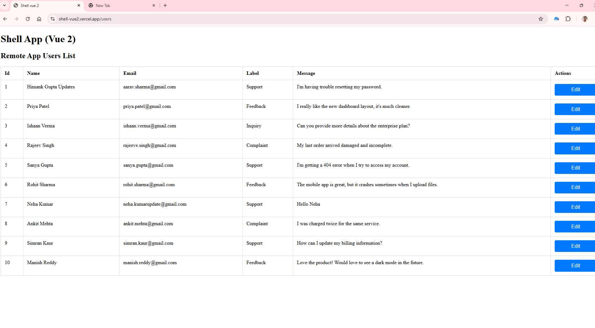
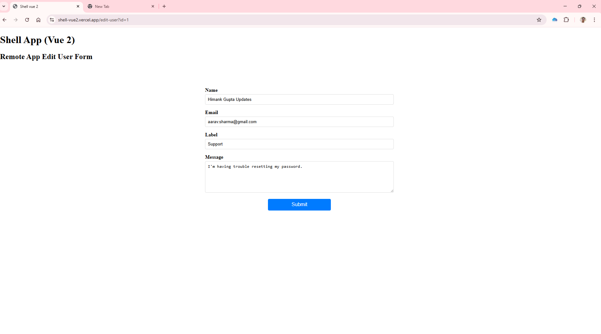
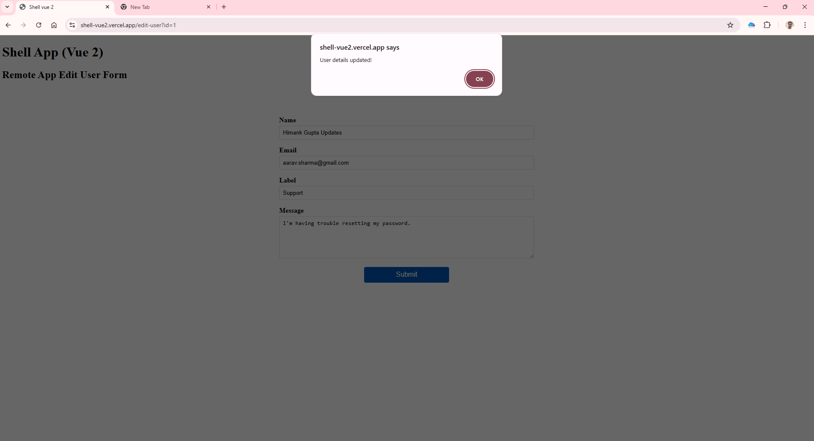

# 🏗️ Modular Frontend Platform — Host App(Vue 2) + Remote Apps(Vue 3) (All Apps Use Webpack Module Federation)

## 💡 Overview

This project demonstrates a **modular micro-frontend architecture**, where a **legacy shell app in Vue 2** that dynamically loads **Vue 3 remote apps with typescript** using **Webpack Module Federation** across all apps.

---

## 🚩 Problem Statement

- **Vue 2 shell app** manages **global store**, **i18n**, and **API actions**.
- **Vue 3 remote apps** are dynamically loaded:
  - Consume the parent’s store reactively
  - Use parent’s i18n instance
  - Emit events to request updates

---

## ⚙️ Module Federation Setup (Used in Shell and All Remote Apps)

### What is Module Federation?

All apps use **Webpack Module Federation** to enable:

- Dynamic runtime loading of remote apps
- Independent builds and deployments
- Shared dependencies at runtime

---

### Where it is used

- ✅ **Shell App (Vue 2)**: Configured as host, loads remotes on demand.
- ✅ **Users App (Vue 3)**: Configured as remote, exposes mount point.
- ✅ **Edit User App (Vue 3)**: Configured as remote, exposes mount point.

---

### Benefits

- 🎯 Independent deployments
- 🚀 On-demand code splitting
- ⚡ Shared runtime libraries
- 🔒 Strong decoupling

---

## 🗺️ Architecture

### Shell App: `shell-vue2`

- Vue 2 app acting as host shell.
- Provides:
  - **Reactive global store** (`Vue.observable`)
  - **i18n instance** (vue-i18n)
  - API actions and routing.
- Loads remotes via routes:
  - `/users`: User List App
  - `/edit-user?id=123`: Edit User App

---

### Remote App 1: `users-app-vue3`

- Vue 3 app
- Displays user table from shell store
- Reacts to updates automatically
- Uses shell i18n for translations

---

### Remote App 2: `edit-user-app-vue3`

- Vue 3 app
- Displays editable user form
- Emits update events to parent on submit
- Parent handles updates using `store.updateUsers()` and simulates API (localStorage)

## 🧩 Shared Services Provided by Shell App

### 💬 Translations (i18n)

- Centralized in shell app
- Remotes **inject i18n** and use `i18n.t(...)`
- Supports adding new languages easily

---

### 🗺️ Router

- Fully owned by shell app
- Controls which remote app is loaded

---

### 🗃️ Global Store

- Central reactive store using `Vue.observable`
- Holds user list and udpdate user
- Parent handles all mutations via `store.updateUsers()` after receiving events from remotes

---

## 💾 Data Simulation & Persistence

### Static Data

- Uses mock user data initialized in shell app.

---

### Local Storage Persistence

- Saves data to local storage after each update.
- Reloads persisted data on refresh.

---

## 🗂️ Dynamic Remote App Loading via `remoteConfig.js`

### Centralized Config Example

```js
{
  path: "/users",
  scope: "user_app_vue3",
  route_name: "users",
  app_name: "user_app_vue3",
  devUrl: "http://localhost:8081/remoteEntry.js",
  prodUrl: "https://users-app-vue3.vercel.app/remoteEntry.js",
  loader: () => import("user_app_vue3/mount"),
}

Benefits
✅ Add new remote apps by only updating remoteConfig.js

✅ No need to touch router or federation config

✅ Scalable and maintainable
```

```
🛠️ Project Setup Guide

1️⃣ Clone the repository
git clone https://github.com/himank226/federation-setup-vue2.git
cd federation-setup-vue2

2️⃣ Install all dependencies
Run this command to install dependencies for all apps (Shell + Remotes):
npm run install:all

3️⃣ Start all apps (Shell + Remotes)
Use the dev script to run all three apps concurrently:
npm run dev

4️⃣ Visit the shell app
Open http://localhost:8080 in your browser.
```

💻 Demonstration

🔗 Live App: https://shell-vue2.vercel.app/

🎥 Walkthrough Video: [link](https://www.loom.com/share/2a86cc963712446cb97539c8b10ccc0f)

💻 Source Code: [GitHub Repository](https://github.com/himank226/federation-setup-vue2)

📸 Screenshots





